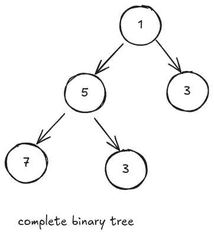

# Heap Data Structure

## Understanding Heap

A complete binary tree is a binary tree where all levels are fully filled, except possibly the last level. If the last level is not fully filled, its nodes must be filled from left to right.

                                 


## Types of heap

### 1- Min Heap

In min heap the value of each node value is less than or equal to the value of its childern. Parent node <= child node.

Its root node contains the smallest value.


### 2- Max Heap

In max heap the value of each node value is greater than or equal to the value of its childern. Parent node >= child node.

Its root node contains the largest value.


## Implementation of heap (Max Heap)

### Why we don't use linked list to implement heap?


- First, We will have to find the node where new node will be inserted it will take O(N). How we will do that? we will do level order traversal, first we traverse through 40 then 32, 28, then 21 and after reaching 22 we will insert node here. But what if we have N nodes then it will O(N) times.

- Now if I add 45 
  
  

- It has disturbed the heap property now  to maintain heap property I have to swap 45 (child) with 22(parent) and then 45 (child) with 32 (parent) and then 45(child) with 40 (parent).

- It will be a complex task and also it will be very time consuming.


### Using Array


Agaar hummm binary tree ka har aik element ko array ka index assign kar da tu humm issa array ki tarhaa use kar payee ga.

ab humm na last element 9th index pa dalaa howa hai agaar future ma koi bhi element ayee ga wo 10th index pa chalaa jayee ga.


ab let say ma 84 insert karta ho tu wo 10th index pa chalaa jayee ga. laikin jab ma 84 insert karo ga tu max heap ki property maintain nahi rah payee gi uss ka lia mujhe 84 ko uss ka parent sa swap karna ho ga. ab wo kaisaa karaa ga?

> **parent index - i**
> 
> agar mujhe i as a parent index dia gayaa hai tu uss ka left child or right child ma aissa nikaal sktaa ho: (waisaa agaar humm 0th index pa kharaa ho kar soocha tu answer asaani sa nikaal sktaa hai)
> 
> - left child -> (2 x i) + 1
> 
> - right child -> (2 x i) + 2

> **child index - i**
> 
> agaar mujhe i as a child index dia gaya hai tu uss ka parent ka index hummm nichaa walaa formula ki madad sa nikaal sktaa hai:
> 
> - (i-1)/2 -> it will give parent index of child.


ab 84 ko sahi position par dalna ka lia hummmm 84 ka parent sa swap karwaa da ga or iss ka parent ka index hummm (i - 1) / 2 ki madad sa nikaal la ga. or yaa humm tab tak karta rahaa ga jab tak 84 sahi position par nahi chalaa jayee ga matlab 84 ka parent uss sa baraa nahi ho jataa yaa phir index 0 nahi ho jataa.


## Algorithm

element ko last inserted element ka baad add karo.

uss ka baad uss ka parent sa compare karo ka wo parent sa chota hai ya nahi agaar baraa hai tu parent sa inserted element sa swap karo or phir dobaraa yahi process karta raho jab tak jab tak parent inserted element sa baraa na ho jayee yaa phir index 0 na ho jayee in dono ma sa koi aik condition bhi true hoti hai tu ruk jao.

## Code

```java
package Heap;

public class Heap 
{
    public int[] heapArray;
    public int current_size;
    public int total_size;

    Heap(int total_size){
        this.total_size = total_size;
        this.current_size = -1;
        heapArray = new int[this.total_size];
    }

    int parentIndex(int index){
        return (index - 1) / 2;
    }

    void swap(int[] arr, int first, int sec){
        int temp = arr[sec];
        arr[sec] = arr[first];
        arr[first] = temp;
    }

    private void insertIntoHeap(int val){
        current_size++;
        heapArray[current_size] = val;
        int i = current_size;

        while(i > 0 && heapArray[i] > heapArray[parentIndex(i)]){
            swap(heapArray, i, parentIndex(i));
            i = parentIndex(i);
        }

    }

    public void insert(int val){
        if(current_size == total_size - 1)
        {
            System.out.println("Heap is full");
            return;
        }
        insertIntoHeap(val);       
    }

    void printHeap(){

        for(int i = 0; i <= current_size; i++){
            System.out.println(heapArray[i]);
        }
    }
}
```

humm current_size ko 0 based indexing ka mutabiq la kar chal raha hai, iss wajaa sa insert function ma current_size == total_size - 1, kar raha hai.

agaar current_size = 0 sa intialize ho ga tu current_size == total_size wali condition.

agaar current_size = -1 sa intialize ho ga tu current_size == total_size - 1 wali condition.

## Time Complexity


    


## Deletion in Max Heap

jab heap ko delete ma koi elment ko delete karna ki baat hoti hai tu hummm hamesha top node ko hi delete karta hai.

### Algorithm

jo last pa element ho ga ussaa top ka element sa overwrite karwaa da ga

or phir uss ka childs ko compare karwayee ga ka kon sa baraa hai or agaar wo parent sa baraa ho ga tu unn dono ko swap karwaa da ga, or yaa humm karta raha ga jab tak parent child sa baraa nahi ho jataa yaa phir index 

last element sa iss waja sa replace karwaa raha hai kio ka agaar kahi or sa karwayee ga tu tree complete binary tree nahi rahaa ga.


### pseudo code

```java
delete()
if(c_s == -1){
    print("there is nothing to delete");
}
hA[0] = hA[c_s]
c_s = c_s - 1
if(c_S == -1)
   return;
heapify(0)
}

heapify(index){
    maxi = index  
    left = 2 X index + 1
    right = 2 X index + 2  
    if(left <= c_s && hA[maxi] < hA[left]) maxi = left
    if(right <= c_s && hA[maxi) < hA[right]) maxi = right
    if(maxi != index){
        swap(hA[index], hA[maxi])
        heapify(maxi);
}
}
```

    


## Complete Code

```java

```
